# DIGITAL DESIGN ASSIGNMENT REPORT


**Assignment ID:** 2

**Student Name:** 刘乐奇

**Student ID:** 12011327


## PART 1: DIGITAL DESIGN THEORY 

1. **a.** 
	
	​	Suppose $F_1 = \sum_{i} m_{1i}$ and $F_2 = \sum_{i}m_{2i}$ , where $m_{1i}$ and $m_{2i}$ are both the minterms of $F_1$ and $F_2$ , respectively. Then $E = F_1 + F_2 = \sum_{i} m_{1i} + \sum_{i}m_{2i} = \sum_{i} (m_{1i} + m_{2i})$
	**b.**
	
	​	Suppose $F_1 = \sum_{i} m_{1i}$ and $F_2 = \sum_{i} m_{2i}$ , where $m_{1i}$ and $m_{2i}$ are both the minterms of $F_1$ and $F_2$ , respectively. Then
	
	$G = F_1·F_2 = \sum_{i} m_{1i}· \sum_{i} m_{2i} = \sum_i \sum_j m_{1i}·m_{2j}$
	
	​	Since the product of different minterms is always 0, then we can know that $G$ only contains the minterms common to $F_1$ and $F_2$. 
	
2. **a.** 
    $F(x, y, z) =  ∑(3, 5, 7) = Π(0, 1, 2, 4, 6)$
    **b.** 
    $F(A, B, C, D) = ∏(3, 5, 8, 11, 12, 15) = ∑(0, 1 , 2, 4, 6, 7, 9, 10, 13, 14)$

3. **a.** 
    $(b’ + d)(a’+ b’+ c)(a’ + c) =$

    $(a' + b' + c' + d)(a' + b' + c + d')(a' + b' + c + d)(a' + b + c + d')(a' + b + c + d)(a + b' + c' + d)(a + b' + c + d) =$

    $∏(14, 13, 12, 9, 8, 6, 4) = ∑(15, 11, 10, 7, 5, 3, 2, 1, 0)$
    **b.** 
    $xy + x’z’+ x’yz = x'y'z' + x'yz' + x'yz + xyz' + xyz= ∑(0, 2, 3, 6, 7) = Π(1, 4, 5)$

4. **a.** 

    ​	True. Since on the left 

    $ y’z’ + yz’ + x’z = (y' + y)z' + x'z = z' + x'z = (x + x')z' + x'z = xz' + x'z' + x'z = xz' + x'(z'+z) = x' + xz' $

    on the right.
    **b.** 

    ​	True. Since on the left

    $ x'y + xz + y'z' = x'yz + x'yz' + xy'z + xyz + xy'z' + x'y'z' = Σ(0, 2, 3, 4, 5, 7)$

    In the meanwhile, on the right 

    $xy’ + x’z’ + yz = xy'z + xy'z' + x'yz' + x'y'z' + xyz + x'yz = Σ(0, 2, 3, 4, 5, 7)$

    With the same SOP, they are equal.

5. **a.** 

    $F (w, x, y, z) = ∑ (8, 10, 12, 13, 14)$

  | wx(col)\yz(row) |  00  |  01  |  11  |  10  |
  | :-------------: | :--: | :--: | :--: | :--: |
  |       00        |      |      |      |      |
  |       01        |      |      |      |      |
  |       11        |  1   |  1   |      |  1   |
  |       10        |  1   |      |      |  1   |

  ​	From the Karnaugh map, we have combinations (12, 14, 8, 10) and (12, 13). Then 

​	$F (w, x, y, z) = ∑ (8, 10, 12, 13, 14) = wxy' + wz'$

  **b.** 

​	$F (A, B, C, D) = ∑ (0, 2, 5, 7, 8, 10, 13, 15)$

  | AB(col)\CD(row) |  00  |  01  |  11  |  10  |
  | :-------------: | :--: | :--: | :--: | :--: |
  |       00        |  1   |      |      |  1   |
  |       01        |      |  1   |  1   |      |
  |       11        |      |  1   |  1   |      |
  |       10        |  1   |      |      |  1   |

  ​	From the Karnaugh map, we have combinations (0, 2, 8, 10) and (5, 7, 13, 15). Then

​	$ F (A, B, C, D) = ∑ (0, 2, 5, 7, 8, 10, 13, 15) = B'D' + BD$

  **c.** 

$AB’CD + AD + AC’ + BCD = A'BCD + AB'C'D' + AB'C'D + AB'CD + ABC'D' + ABC'D + ABCD$

  | AB(col)\CD(row) |  00  |  01  |  11  |  10  |
  | :-------------: | :--: | :--: | :--: | :--: |
  |       00        |      |      |      |      |
  |       01        |      |      |  1   |      |
  |       11        |  1   |  1   |  1   |      |
  |       10        |  1   |  1   |  1   |      |

  ​	From the Karnaugh map, we have combinations (8, 9, 12, 13) (9, 11, 13,15) (7, 15). Then 

​	$AB’CD + AD + AC’ + BCD = $

$A'BCD + AB'C'D' + AB'C'D + AB'CD + ABC'D' + ABC'D + ABCD = $

$BCD + AD + AC'$

  **d.**

$ A’B’C’D + ABCD + A’BC’ + AB’C + AB’D = A'B'C'D + A'BC'D' + A'BC'D + AB'C'D + AB'CD' + AB'CD + ABCD$

| AB(col)\CD(row) |  00  |  01  |  11  |  10  |
| :-------------: | :--: | :--: | :--: | :--: |
|       00        |      |  1   |      |      |
|       01        |  1   |  1   |      |      |
|       11        |      |      |  1   |      |
|       10        |      |  1   |  1   |  1   |

​	From the Karnaugh map, we have combinations (1, 9) (10, 11) (4, 5) (11, 15). Then 

$A’B’C’D + ABCD + A’BC’ + AB’C + AB’D = $

$A'B'C'D + A'BC'D' + A'BC'D + A'BCD + AB'C'D + AB'CD' + AB'CD = $

$B'C'D + A'BC' + ACD + AB'C$

6. **a.** 

   $F(A, B, C, D) = A’B’C’D + CD’ + AC’D$

   $= A'B'C'D + (A + A')(B+ B')CD' + A(B+ B')C'D$

   $= A'B'C'D + A'B'CD' + A'BCD' + ABCD' + AB'CD' + ABC'D + AB'C'D$

   $= Σ(1, 2, 6, 9, 10, 13, 14)$

   $= Π(0, 3, 4, 5, 7, 8, 11, 12, 15)$

   | AB(col)\CD(row) |  00  |  01  |  11  |  10  |
   | :-------------: | :--: | :--: | :--: | :--: |
   |       00        |  0   |      |  0   |      |
   |       01        |  0   |  0   |  0   |      |
   |       11        |  0   |      |  0   |      |
   |       10        |  0   |      |  0   |      |

   By simplifying the boolean function, we have

   $F(A, B, C, D) = (C+D)(C'+D')(A+B'+D')=((C+D)'+(C'+D')'+(A+B'+D')')'$

   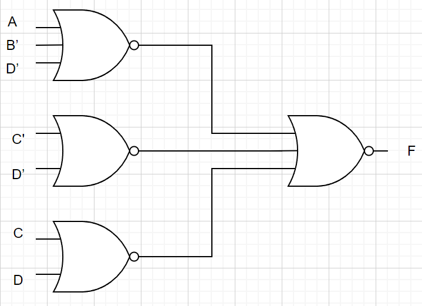

   **b.**

   ​	 $F(A, B, C, D) = A’+ AB + B’C + ACD$

   $=(A'+A)(A'+B)+B'C+ACD$

   $=(A'+A)(A'+CD)+(B+B')(B+C)$

   $=A'+B+C+CD$

   $=A'+B+C(D+D')+CD$

   $=A'+B+CD+CD'$

   $=A'+B+C(D+D')$

   $=A'+B+C$

   $=((A'+B+C)'+(A'+B+C)')'$

   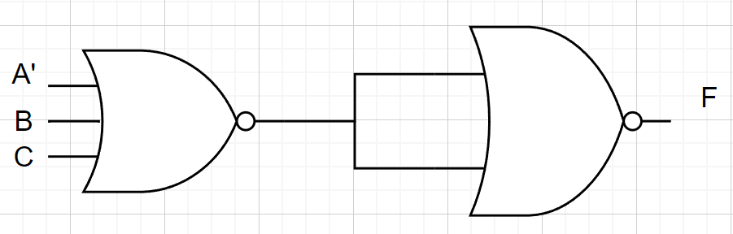

7. **a.**

   ​	 $F(A,B,C,D) = ∑(4, 12, 7, 2, 10)$ with $ d(A, B, C, D)= ∑(0, 6, 8)$

   | AB(col)\CD(row) |  00  |  01  |  11  |  10  |
   | :-------------: | :--: | :--: | :--: | :--: |
   |       00        |  x   |      |      |  1   |
   |       01        |  1   |      |  1   |  x   |
   |       11        |  1   |      |      |      |
   |       10        |  x   |      |      |  1   |

   ​	From the Karnaugh map, we have combinations (0, 4, 8, 12) (6, 7) (0, 2, 8, 10). Then the function with don't-care conditions can be simplified as 

   ​	$F(A, B, C, D) = A'BC + B'D' + C'D'$

   $=A'B'C'D'+A'B'CD'+A'BC'D'+A'BCD'+A'BCD+ABC'D'+AB'C'D'+AB'CD'$

   **b.** 

   ​	$F(A, B, C, D) = ∑( 2, 4, 10, 12, 14)$ with $d(A, B, C, D)= ∑(0, 1, 5, 8)$

   | AB(col)\CD(row) |  00  |  01  |  11  |  10  |
   | :-------------: | :--: | :--: | :--: | :--: |
   |       00        |  x   |  x   |      |  1   |
   |       01        |  1   |  x   |      |      |
   |       11        |  1   |      |      |  1   |
   |       10        |  x   |      |      |  1   |

   ​	From the Karnaugh map, we have combinations (0, 4, 8, 12) (0, 2, 8, 10) (10, 14). Then the function with don't-care conditions can be simplified as 

   ​	$F(A, B, C, D) = C'D' + B'D' + ACD'$

   $=A'B'C'D'+A'B'CD'+A'BC'D'+AB'C'D'+AB'CD'+ABC'D'+ABCD'$

8. 

   ​	$F = A’BC’D + AB’CD’ + ABC’D’ + A’B’CD$

​			  $= A'D(BC' + B'C) + AD'(B'C + BC')$

​		  	$= (B \oplus C)(A'D + AD')$

​		  	$= (B \oplus C)(A \oplus D)$

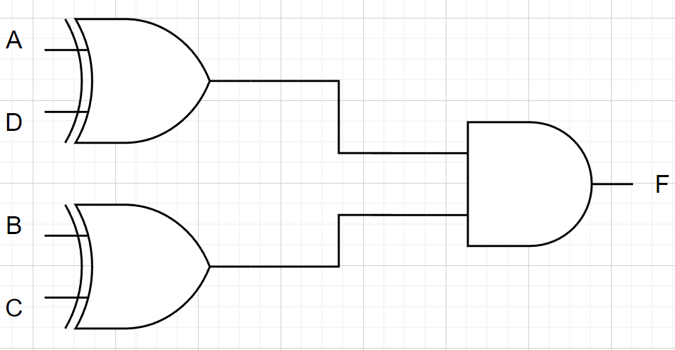


## PART 2: DIGITAL DESIGN LAB (TASK 1)

### DESIGN

**(This part is always REQUIRED)**

*Describe the design of your system by providing the following information:*

- *Verilog design (provide the Verilog code)*. 

```verilog
//task1.v
`timescale 1ns / 1ps

module task1(
    input sw,
    input [3:0] in,
    output reg [7:0] seg_out,
    output  [7:0] seg_en,
    output [3:0] out
    );
    assign seg_en = ~8'b0000_0001;
    assign out = in;  
    always @* begin
       if(sw == 1'b1) begin
           casex(in)
               4'b0001: seg_out = 8'b0100_0000;  // 0
               4'b001x: seg_out = 8'b0111_1001;  // 1
               4'b01xx: seg_out = 8'b0010_0100;  // 2
               4'b1xxx: seg_out = 8'b0011_0000;  // 3
               default: seg_out = 8'b1111_1111;
           endcase
       end
       if(sw == 1'b0) begin
            casex(in)
                4'bxxx1: seg_out = 8'b0100_0000;  // 0
                4'bxx10: seg_out = 8'b0111_1001;  // 1
                4'bx100: seg_out = 8'b0010_0100;  // 2
                4'b1000: seg_out = 8'b0011_0000;  // 3
                default: seg_out = 8'b1111_1111;
            endcase
       end
   end
endmodule
```

​	`seg_en` is used to control the 7-seg tube. Here I set it as `8'b0000_0001` is to garantee that there is at most only one 7-seg tube to be lit on. `sw` is used to change the priority of the wards bell, `sw == 1'b1` as priority `3 > 2 > 1 > 0` and `sw == 1'b0` as priority `0 > 1 > 2 > 3`. `in` is used to denote which ward bell(s) is(are) on . `out` is used to listen to the input signal from `in`. `seg_out` is used to control the behaviour of the 7-seg tube, with default always `8'b1111_1111`, meaning no light on.

### CONSTRAINT FILE AND TESTING

**(This part is optional depending on the requirement of the lab task)**

*Describe how you test your design on the Minisys Practice platform* 

- *Constraint file (provide the screenshots on the feature of a pin and the binding info between pins and the input /output ports)*

```verilog
//task1.xdc
set_property IOSTANDARD LVCMOS33 [get_ports sw]

set_property IOSTANDARD LVCMOS33 [get_ports {in[3]}]
set_property IOSTANDARD LVCMOS33 [get_ports {in[2]}]
set_property IOSTANDARD LVCMOS33 [get_ports {in[1]}]
set_property IOSTANDARD LVCMOS33 [get_ports {in[0]}]

set_property IOSTANDARD LVCMOS33 [get_ports {out[3]}]
set_property IOSTANDARD LVCMOS33 [get_ports {out[2]}]
set_property IOSTANDARD LVCMOS33 [get_ports {out[1]}]
set_property IOSTANDARD LVCMOS33 [get_ports {out[0]}]

set_property IOSTANDARD LVCMOS33 [get_ports {seg_en[0]}]
set_property IOSTANDARD LVCMOS33 [get_ports {seg_en[1]}]
set_property IOSTANDARD LVCMOS33 [get_ports {seg_en[2]}]
set_property IOSTANDARD LVCMOS33 [get_ports {seg_en[3]}]
set_property IOSTANDARD LVCMOS33 [get_ports {seg_en[4]}]
set_property IOSTANDARD LVCMOS33 [get_ports {seg_en[5]}]
set_property IOSTANDARD LVCMOS33 [get_ports {seg_en[6]}]
set_property IOSTANDARD LVCMOS33 [get_ports {seg_en[7]}]

set_property IOSTANDARD LVCMOS33 [get_ports {seg_out[0]}]
set_property IOSTANDARD LVCMOS33 [get_ports {seg_out[1]}]
set_property IOSTANDARD LVCMOS33 [get_ports {seg_out[2]}]
set_property IOSTANDARD LVCMOS33 [get_ports {seg_out[3]}]
set_property IOSTANDARD LVCMOS33 [get_ports {seg_out[4]}]
set_property IOSTANDARD LVCMOS33 [get_ports {seg_out[5]}]
set_property IOSTANDARD LVCMOS33 [get_ports {seg_out[6]}]
set_property IOSTANDARD LVCMOS33 [get_ports {seg_out[7]}]

set_property PACKAGE_PIN W4 [get_ports sw]

set_property PACKAGE_PIN Y8 [get_ports {in[3]}]
set_property PACKAGE_PIN Y7 [get_ports {in[2]}]
set_property PACKAGE_PIN W9 [get_ports {in[1]}]
set_property PACKAGE_PIN Y9 [get_ports {in[0]}]

set_property PACKAGE_PIN K14 [get_ports {out[3]}]
set_property PACKAGE_PIN M13 [get_ports {out[2]}]
set_property PACKAGE_PIN L13 [get_ports {out[1]}]
set_property PACKAGE_PIN K17 [get_ports {out[0]}]

set_property PACKAGE_PIN A18 [get_ports {seg_en[7]}]
set_property PACKAGE_PIN A20 [get_ports {seg_en[6]}]
set_property PACKAGE_PIN B20 [get_ports {seg_en[5]}]
set_property PACKAGE_PIN E18 [get_ports {seg_en[4]}]
set_property PACKAGE_PIN F18 [get_ports {seg_en[3]}]
set_property PACKAGE_PIN D19 [get_ports {seg_en[2]}]
set_property PACKAGE_PIN E19 [get_ports {seg_en[1]}]
set_property PACKAGE_PIN C19 [get_ports {seg_en[0]}]

set_property PACKAGE_PIN E13 [get_ports {seg_out[7]}]
set_property PACKAGE_PIN C15 [get_ports {seg_out[6]}]
set_property PACKAGE_PIN C14 [get_ports {seg_out[5]}]
set_property PACKAGE_PIN E17 [get_ports {seg_out[4]}]
set_property PACKAGE_PIN F16 [get_ports {seg_out[3]}]
set_property PACKAGE_PIN F14 [get_ports {seg_out[2]}]
set_property PACKAGE_PIN F13 [get_ports {seg_out[1]}]
set_property PACKAGE_PIN F15 [get_ports {seg_out[0]}]
```

- *The testing result (provide the screenshots (at least 3 testing scenes) to show the state of inputs and outputs along with the related descriptions.*

==Here I use the four left most button to simulate the bell in each ward, from left to right #0 #1 #2 #3.==

==Meanwhile, I use the right most button to simulate the switch which is used to change priority.==

==For all buttons, down is off (0), and up is on (1).==

==The room number would be shown in the up-left 7-seg tube light.==

1. Without any operation, nothing happens.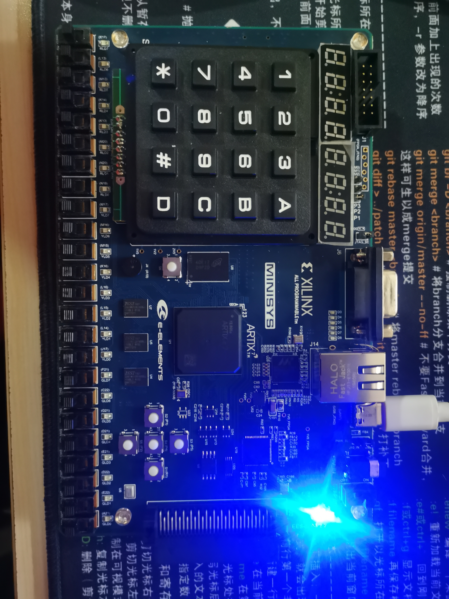

2. `sw` turn down, that is, the priority is `0 > 1 > 2 > 3`.
   1. Only `#3` turned on, representing `#3`.
   
       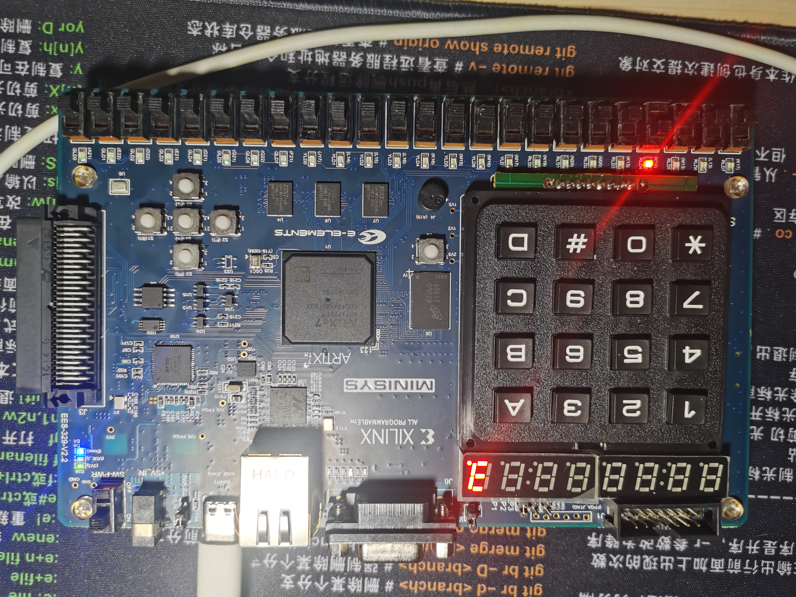
   
      
   
   2. Only `#2` turned on, representing `#2`.
   
       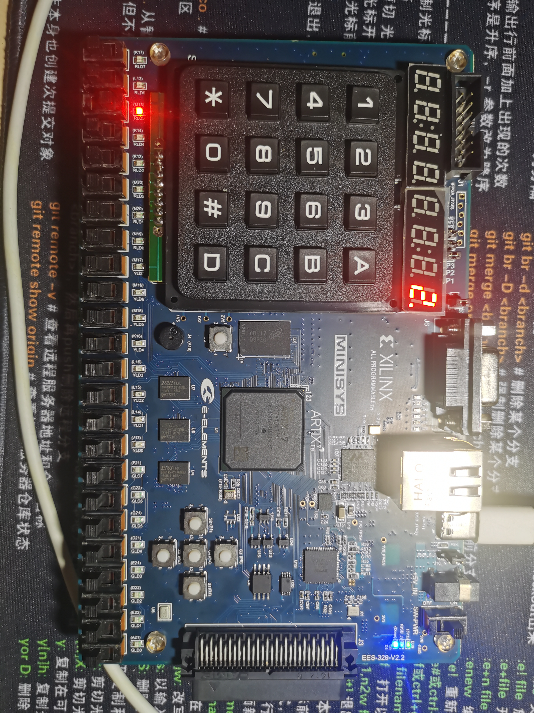
   
      
   
   3. Only `#1` turned on, representing `#1`.
   
       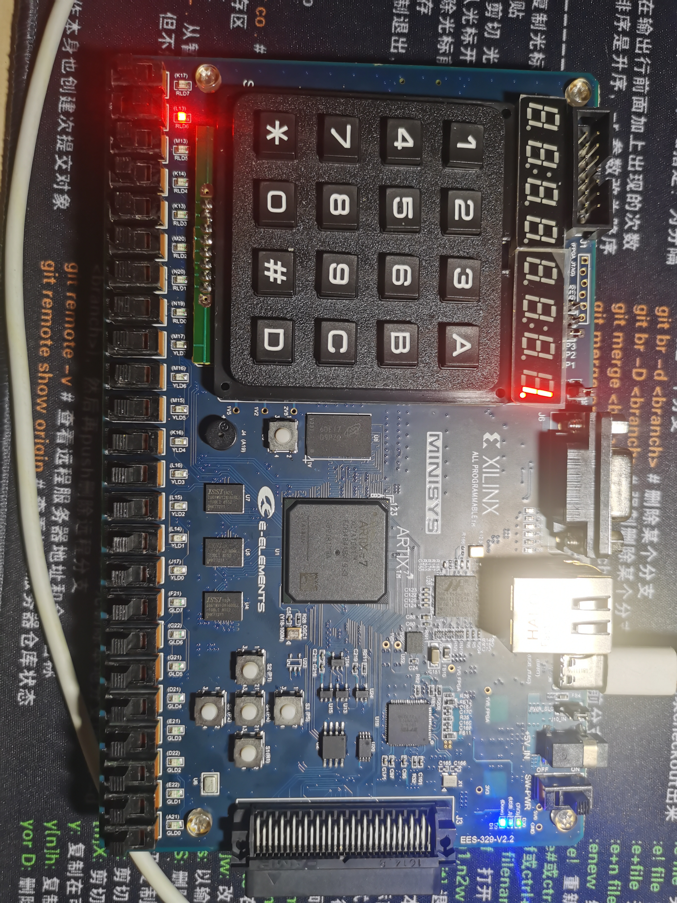
   
      
   
   4. Only `#0` turned on, representing `#0`.
   
       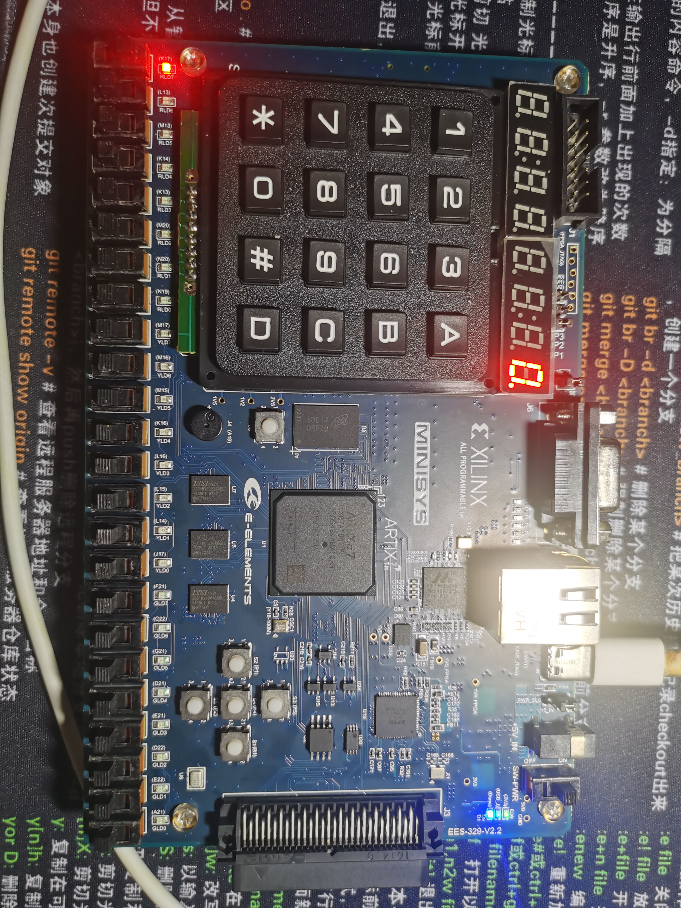
   
      
   
   5. With `#2` and `#3` turned on, only represent `#2`.
   
       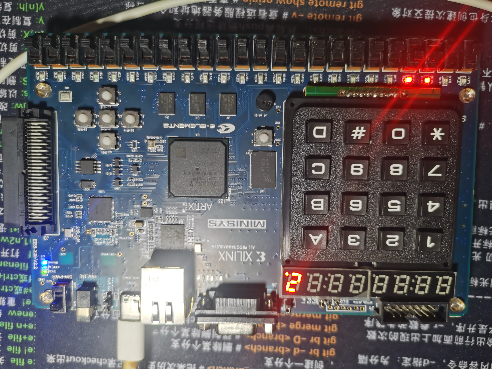
   
      
   
   6. With `#1`,  `#2` and `#3` turned on, only represent `#1`.
   
       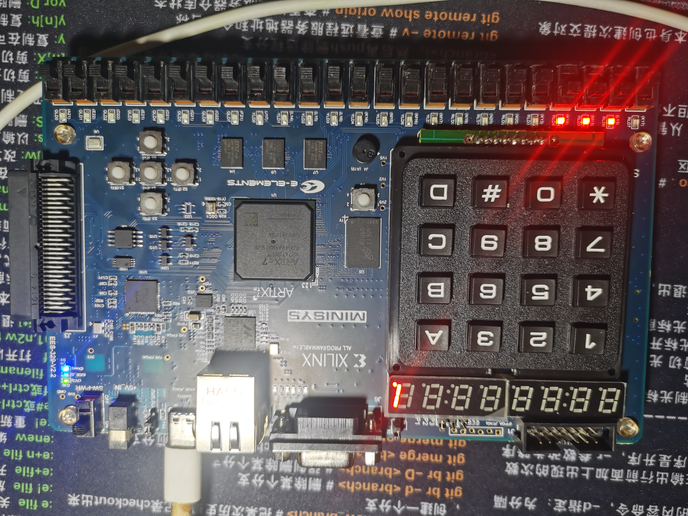
   
      
   
   7. With all turned on, only represent `#0`.
   
       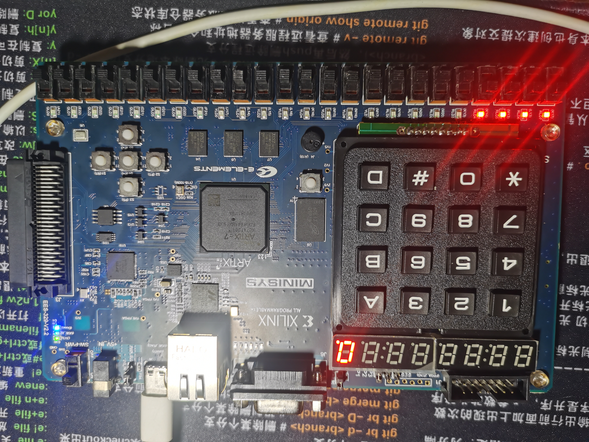
   
      
   
   8. With `#0` and `#3` turned on, only represent `#0`.
   
       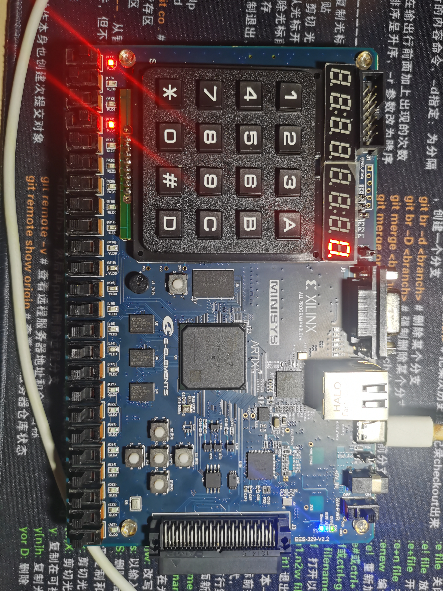
   
      
   
3. `sw` turn up, that is, the priority is `3 > 2 > 1 > 0`.
   
   1. With `#0` and `#3` turned on, only represent `#3`.
   
       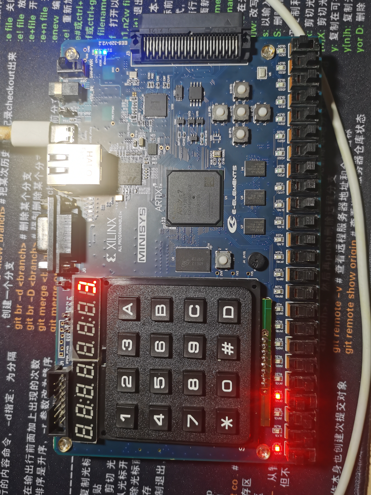
   
      
   
   2. With `#0` and `#2` turned on, only represent `#2`. 
   
       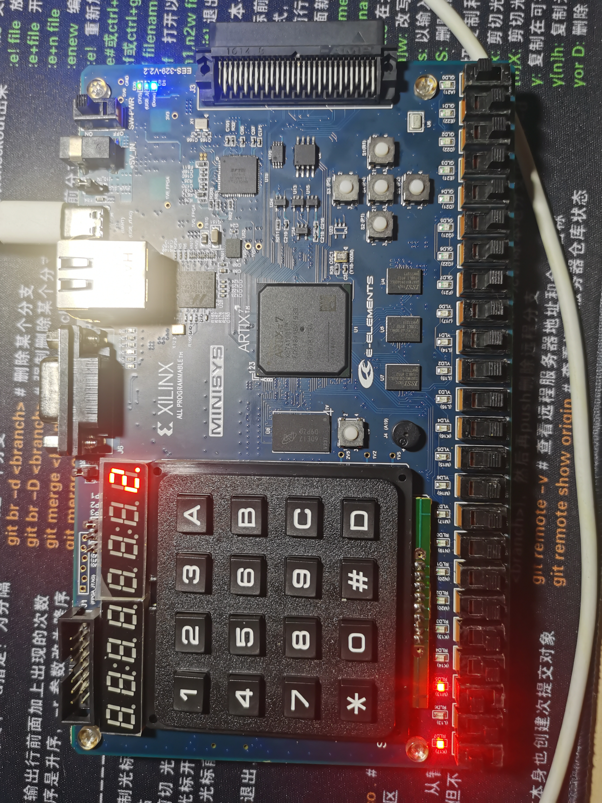
   
      
   
   3. With `#1` and`#3` turned on, only represent `#3`.
   
       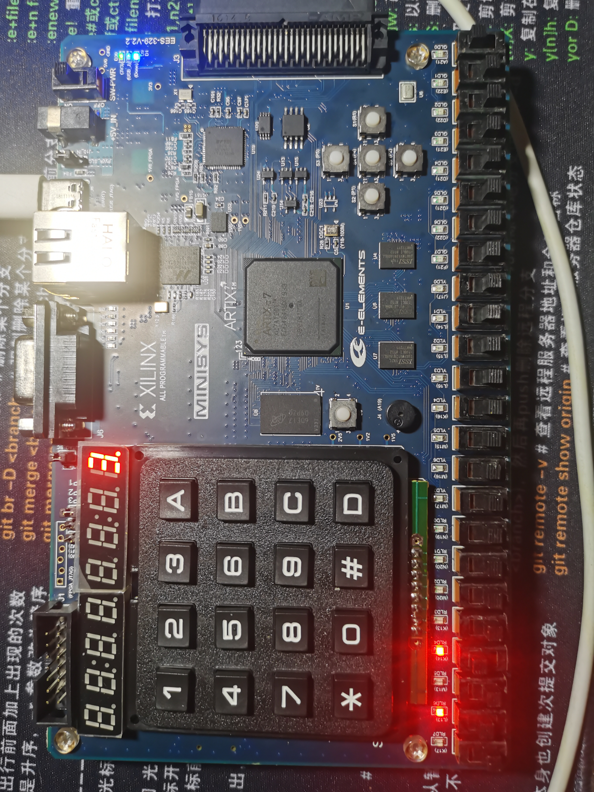
   
      

### Schematic

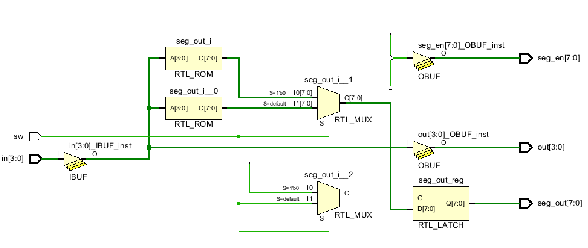

### THE DESCRIPTION OF OPERATION

**(This part is always REQUIRED unless you can get full marks for this lab task)**

*Describe the problems that occurred while in the lab and your solution. Any suggestions are welcomed.*

- *Problems and solutions*

1. 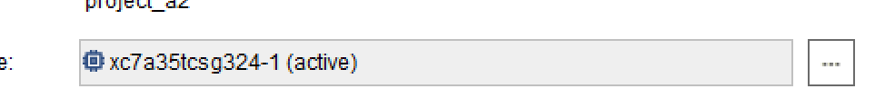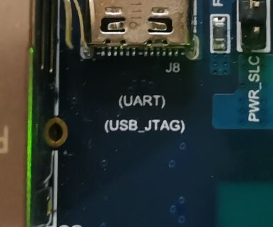

​	First time I generated the bitstream file after synthesis and implementation, I met the warning (picture on the left most). The log messages were so wired that I could not found why right now (I forgot to copy the picture of the log messages), and there was no solution on the Internet. So I try to guess the reason.

​	I thought that it may be because the type of the board was mismatched (teacher had told that we might have two different types of board). So I changed the type from `xc7a100tfgg484-1`   to `xc7a35tcsg324-1` (picture in the middle). However, it was no longer that I found that's wrong since the board uses `USB_JTAG` which denotes type  `xc7a100tfgg484-1`.

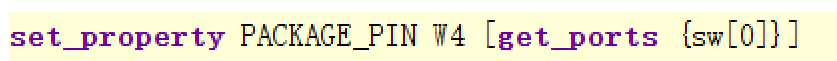  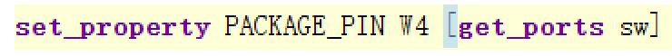

​	After all, I found that it was because my constraint file went wrong, for some port-bindings were illegal. Here `sw` is defined as 1-width. I should change `{sw[0]}` to `sw`.

2. 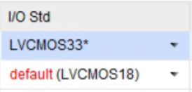 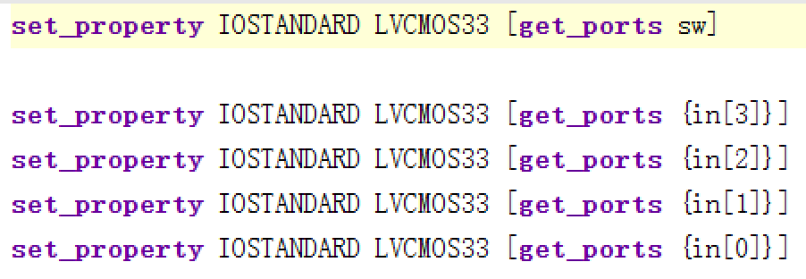

​	It is common to found the above situation in creating constraint file (picture on the left). Here I reviewed the video on the blackboard and found that I should set the second row to `LVCMOS33` (the same as the previous line).

​	Besides, it can also be modified in the constraint file by using code (picture on the right). But don't forget to save and reload, or nothing would be changed.

## PART 2: DIGITAL DESIGN LAB (TASK 2)

### DESIGN

**(This part is always REQUIRED)**

*Describe the design of your system by providing the following information:*

- *Verilog design (provide the Verilog code)*. 

```verilog
//task2.v
`timescale 1ns / 1ps

module task2#(parameter WIDTH=1)(
    input [WIDTH-1:0] a,
    input [WIDTH-1:0] b,
    input [WIDTH-1:0] c,
    output [WIDTH-1:0] out1,
    output [WIDTH-1:0] out2,
    output [WIDTH-1:0] out3
    );
    //xor
    assign out1 = a ^ b ^ c;
    //SOP
    assign out2 = (a & b & c) | (~a & ~b & c) | (~a & b & ~c) | (a & ~b & ~c);
    //POS
    assign out3 = (a | b | c) & (a | ~b | ~c) & (~a | b | ~c) & (~a | ~b | c);
endmodule
```

- *Other design content, depending on the task requirement, to list a few:*

  - *Truth-table*

  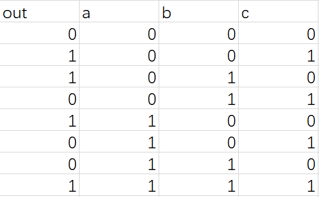

  - *Karnaugh map*

  | c(col) \ ab(row) |  00  |  01  |  11  |  10  |
  | :--------------: | :--: | :--: | :--: | :--: |
  |        0         |      |  1   |      |  1   |
  |        1         |  1   |      |  1   |      |

  - *Boolean expression*

  SOP:

  $F(a, b, c) = a \wedge b \wedge c = abc + a'b'c + a'bc' + ab'c' $

  ​										$= \sum (1,2,4,7)$

  POS:

  $F(a, b, c) = a \wedge b \wedge c = (a+b+c)(a'+b'+c)(a'+b+c')(a+b'+c')$

  ​										$= \prod (0,3,5,6)$


### SIMULATION

**(This part is optional depending on the requirement of the lab task)**

*Describe how you build the test bench and do the simulation.* 

- *Using Verilog (provide the Verilog code)*

```verilog
//task2_sim.v
`timescale 1ns / 1ps

module task2_sim();
    reg a, b, c;
    wire out1, out2, out3;

    task2 t(.a(a),.b(b),.c(c),.out1(out1),.out2(out2),.out3(out3));

    initial begin
        {a, b, c} = 3'b000; 
        while({a, b, c} < 3'b111) begin
            #10 {a, b, c} = {a, b, c} + 1;
        end
        #10 $finish();
    end
endmodule
```

- *The waveform of simulation result (provide screenshots)*

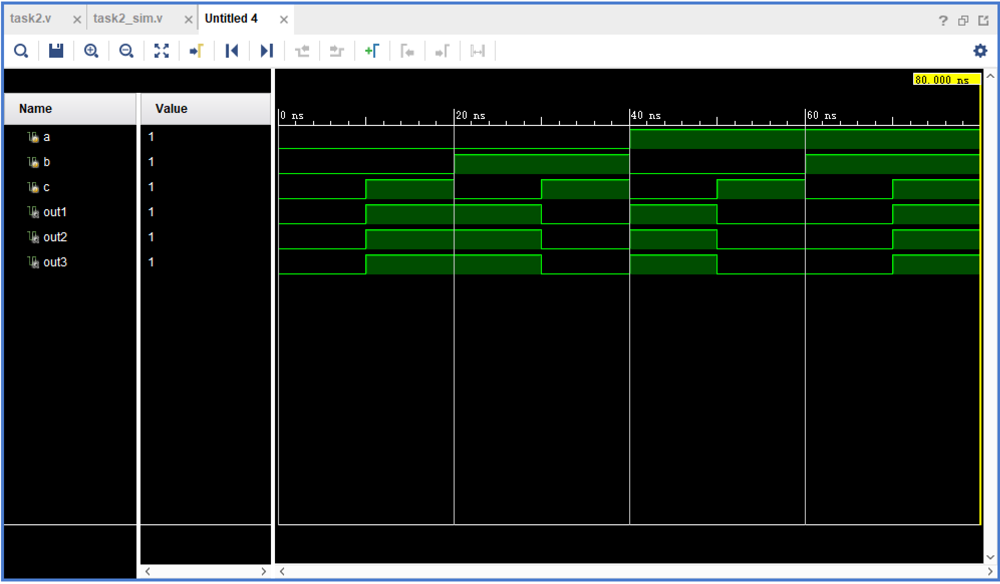

- *The description on whether the simulation result is the same as the truth-table, and whether the function of the design meets the expectation.*

	​	The result of the simulation waveform is well matched to the truth-table. So no matter whether the boolean function is in its original form, SOP or POS, the results always keep synchronous. That is, the design meets the expectation.

### THE DESCRIPTION OF OPERATION

**(This part is always REQUIRED unless you can get full marks for this lab task)**

*Describe the problems that occurred while in the lab and your solution. Any suggestions are welcomed.*

- *Problems and solutions*

1.  Using `xor` is hardly seen in the previous assignments' and labs' exercises. So I was firstly astonished by task2. But it is easy to realize that $x \oplus y = xy' + x'y$.
2.  It must be remembered that $1$ in minterm corresponds $0$ in maxterm, that is, SOP and POS are a group  of dual.

